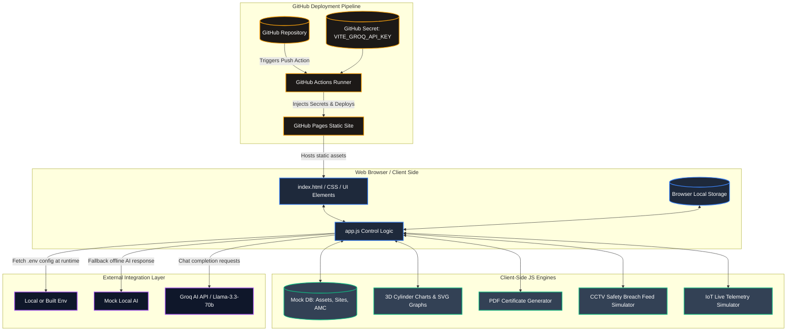

# FireSafe OS - System Documentation & Architecture

This document provides a comprehensive overview of the design, features, architecture, and deployment model of **FireSafe OS** (Safety Compliance & Inspection Engine).

---

## 1. System Architecture

Below is the high-level architecture diagram showing how the client-side user interface interacts with external APIs, GitHub deployment, and internal engines.

---

## 2. Component Explanations & Features

### Core Modules
1. **Control Logic (`app.js`)**: Coordinates all events, tab transitions, QR code scan simulation, AI image bounding box calculations, and API queries.
2. **Environment & Keys Routing**: Falls back to private browser `localStorage` if `.env` is unavailable. Supports `VITE_GROQ_API_KEY` and `GROQ_API_KEY` for seamless API call authorization.
3. **Mock Databases**: Houses predefined records for sites, AMC service details, safety equipment configurations, and historical inspection timelines.

---

## 3. Page-by-Page Functions & Features

### 1. Executive Control Dashboard (`dashboard`)
* **Purpose:** High-level summary of organization-wide compliance.
* **Features:**
  * Interactive metrics grid displaying total monitored assets, active contracts, and failed audits.
  * Real-time alerts feed capturing recent security updates.
  * Live status indicator reflecting system synchronization.

### 2. Smart Inspection Workflow (`inspection`)
* **Purpose:** Guided flow for field technicians to test and verify fire safety assets.
* **Features:**
  * Interactive QR scanner simulator that references localized database indexes.
  * Product photo uploader with toggles for common inspection checkpoints (Pressure Gauge, Cylinder Neck, Safety Pin & Seal).
  * Canvas-rendered bounding boxes displaying detected issues (e.g. "Low PSI", "Surface Rust", "Missing Seal").
  * Instant AI diagnostics report with compliance verdict generation.

### 3. Reports & Certificates (`reports`)
* **Purpose:** Reviewing compliance verdicts and printing official inspection certificates.
* **Features:**
  * Dynamic PDF-style certificate layout generator.
  * Multi-asset download functionality allowing users to export single or batch safety certificates.

### 4. Safety Asset Registry (`assets`)
* **Purpose:** Database view of all monitored hardware across all active sites.
* **Features:**
  * Detailed asset list with search and filter capabilities.
  * Side drawer panel rendering the comprehensive historical timeline (installation logs, service history, and former audit outcomes).

### 5. AMC & Service Management Ledger (`amc`)
* **Purpose:** Ledger tracking Annual Maintenance Contracts.
* **Features:**
  * Client list detailing value per month, tech assignments, next service schedules, and renewal dates.

### 6. Compliance AI Knowledge Hub (`chat`)
* **Purpose:** AI assistant powered by Groq SDK to address technical safety questions.
* **Features:**
  * Auto-recovering chat interface linked with `llama-3.3-70b-versatile`.
  * Offline-mode fallback responder if keys are missing or api rate-limits are reached.

### 7. Customer Portal (`customer`)
* **Purpose:** External interface for clients to verify their own safety status.
* **Features:**
  * Site-specific filtered lists displaying asset expiration schedules and certificate access.

### 8. IoT Live Telemetry (`telemetry`)
* **Purpose:** Real-time stream of sensor metrics (room temperature, canister weight, loop state).
* **Features:**
  * Dynamic 3D isometric cylinder SVG charts demonstrating real-time levels.

### 9. Technician Dispatch Map (`dispatch`)
* **Purpose:** Dispatch coordination and routing maps.
* **Features:**
  * Interactive map coordinates matching designated client locations.

### 10. CCTV Safety Video Analytics (`cctv`)
* **Purpose:** Real-time hazard monitoring using mock visual analytics.
* **Features:**
  * Live visual scan lines and flashing breach warnings.
  * Web Audio API synthesis generating alert signals during simulated breaches.

### 11. Predictive Health Forecasting (`analytics`)
* **Purpose:** Charting long-term safety forecasts and degradation rates.
* **Features:**
  * Interactive graphs forecasting pressure drops and rust formation.

---

## 4. Secure Deployment Pipeline

* **GitHub Pages Hosting:** The application runs as a static client-side single page app.
* **Secret Injection via Actions:** To secure the Groq AI key, a custom GitHub Actions script builds a local `.env` during deployment from the repository's repository secrets, preventing credential leakage in open-source commits.
